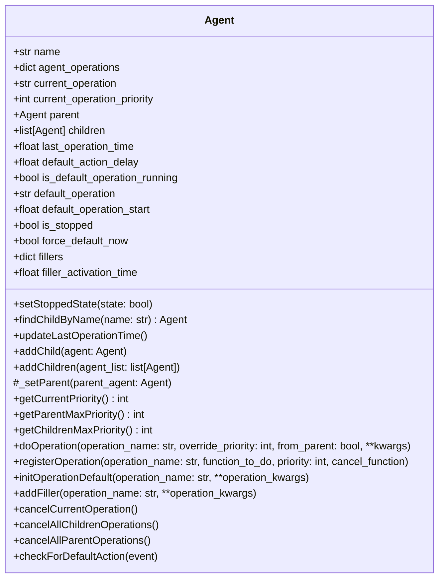
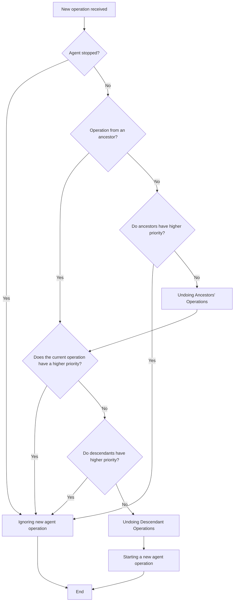
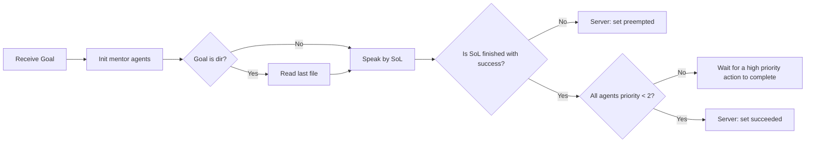
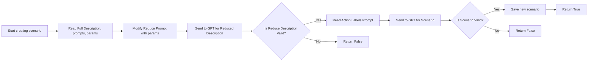

# Мультиагентная система управления антропоморфным роботом

Проект представляет собой конструкторы для создания мультиагентной системы управления антропоморфным роботом на ROS1. Система автоматизирует выполнение сценариев, разрешает конфликты операций и генерирует адаптивные сценарии поведения с использованием GPT.

---

## 🛠 Основные компоненты

### 1. **Базовый агент (`Agent.py`)**
- **Наследование**: Все агенты должны наследоваться от класса `Agent`.
- **Конфликт-менеджмент**:  
  Автоматическое разрешение конфликтов на основе:
  - **Приоритета операций** (чем выше приоритет, тем важнее действие).
  - **Иерархии агентов** (родительские агенты могут переопределять действия дочерних).
- **Поведение по умолчанию**:  
  После завершения операций агент возвращается к заданному действию (например, поза покоя). 
  - **Филлеры**: Случайные действия при долгом бездействии для поддержания интерактивности.

#### Все атрибуты класса:



#### Алгоритм разрешения конфликтов:



### 2. **Диспетчер (`Dispatcher.py`)**
- **Координация**:  
  Управляет воспроизведением текста через синтезатор речи [SOL](!https://github.com/asanmalyshev/speak_out_loud) и парсит метки действий.
- **Метки действий**:  
  Формат `<тип:параметр_1;параметр_n>`. Примеры:
  - Поза: `<pose:left_arm;attention>`
  - Анимация: `<anim:right_arm;slow_splash;2>`
- **Синхронизация**:  
  После завершения сценария переводит агентов в режим по умолчанию.

#### Общий алгоритм обработки цели

### 3. **Пример агента (`AgentLimb.py`)**
- **Расширенный конфликт-менеджмент**:  
  Вместо отмены операций ожидает завершения анимаций (например, последние 25% времени выполнения).
- **Интеграция с ROS**:  
  Использует ActionLib для управления позами и анимациями конечностей робота.

### 4. **Генератор сценариев (`CreateScenarioServer.py`)**
- **Автоматизация**:  
  Создает тексты для робота-экскурсовода на основе GPT:
  - Адаптация под длительность, стиль (технический/школьный) и наличие юмора.
  - Расстановка меток действий.
- **Файловая структура**:  
```bash
multiagent_system
├── src/
│ ├── Dispatcher.py
│ ├── Agent.py
│ ├── AgentLimb.py
│ └── CreateScenarioServer.py
├── config/
│ ├── full_description/  # Описания экспонатов (название = имя файла)
│ ├── prompt/ # Шаблоны для GPT: сокращение текста и метки
│ └── scenario/ # Результаты генерации (scenario_1.txt, ...), разложенные по папкам (название = имя дирректории)
├── action/
│ ├── CreateScenario.action
│ └── MultiAgentScenarioExecutor.action
└── README.md
```
#### Общий алгоритм обработки цели


## 🌟 Особенности системы
- **Самовосстановление**:  
Автоматически корректирует ошибки, вызванные «галлюцинациями» GPT.
- **ROS-совместимость**:  
Легко адаптируется под любого антропоморфного робота.
- **Гибкость**:  
- Новые операции добавляются через `register_operation()`.
- Иерархия агентов настраивается методом `add_children()`.
- **Практическое применение**:  
Система внедрена в реального робота-экскурсовода и успешно используется.

## 📂 Структура репозитория
- `Agent.py` — базовый класс агента.
- `AgentLimb.py` — пример агента для управления конечностями.
- `Dispatcher.py` — диспетчер для координации команд.
- `CreateScenarioServer.py` — генератор сценариев.
- `action/` — кастомные ROS-action файлы.
- `config/` — конфигурации для генерации сценариев.

## 🚀 Использование
1. **Запуск генератора сценариев**:
```bash
rosrun moc_multiagent_scenario create_scenario_action_server.py
```
2. **Запуск диспетчера**:
```bash
rosrun moc_multiagent_scenario multiagent_dispatcher.py
```
3. **Интеграция с роботом:**:
- Настройте агенты под специфику вашего робота, унаследовав их от Agent
- В Dispatcher: создайте иерархию, определите тип меток действий
- Добавьте правила формирования меток в промпт

## 📜 Лицензия
Проект разработан в рамках выпускной квалификационной работы.
Лицензия: MIT.

**Автор:** Moscovskaya, E.D.
**Репозиторий:** [репо](!https://github.com/moskovskayaliza2002)