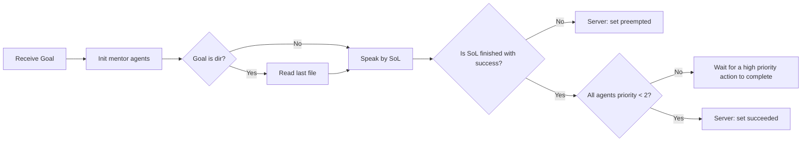
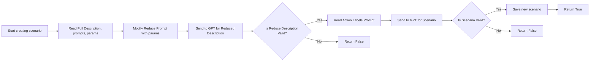
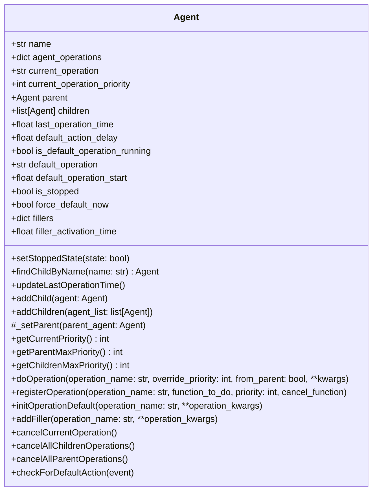
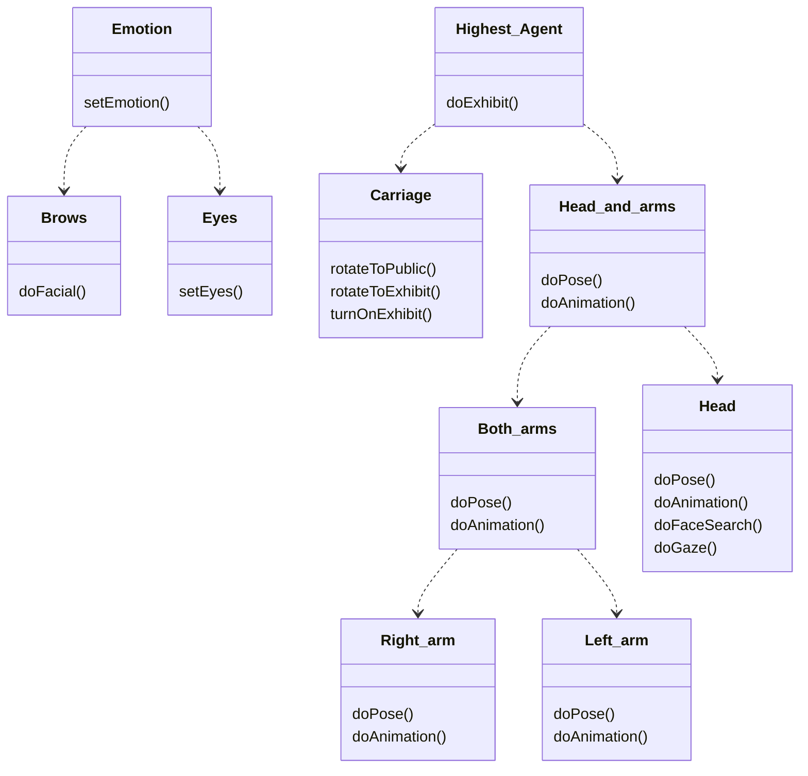
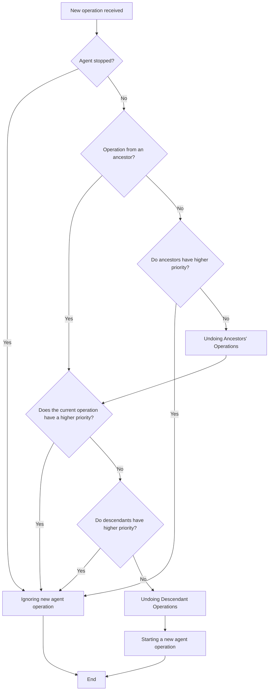

# Table of content
* [multiagent_scenario package](#moc_multiagent_scenario-package)
  * [Dispatcher.py](#dispatcherpy)
  * [CreateScenarioServer.py](#createscenarioserver.py)
* [Action labels](#action-labels)
* [Agents and their hierarchy](#agents-and-their-hierarchy)
  * [Hierarchy](#hierarchy)
  * [Сonflict resolution algorithm](#conflict-resolution-algorithm)

# moc_multiagent_scenario package
Current nodes:
- [x] multiagent_scenario - performs multi-agent control
- [x] create_scenario_action_server - creates a scenario using an extended exhibit description and labels
- [x] generate_all_scenarious - this node creates all scenarios for excursion

## Dispatcher.py
Registers agents and sets a hierarchy. Sends the script to SoL, receives action labels from it, and sends it to the appropriate agent for execution.



### Parameters
**goal.text should be name of the exhibit with "/" in the end, example: cyberhill/**
- **~rot_velocity** (type: double, default: 1.5) - rotation velocity of mentor-1 carriage.
- **~angle_error** (type: double, default: 0.15) - acceptable error when making a rotation.
- **~crowd_frame_name** (type: str, default: "crowd") - listeners crowd frame name.
- **~gaze_time** (type: double, default: 2.0) - time spent looking at an object.
- **~joints_path** (type: str, default: "$(find moc_config)/config/android/joints.yaml") - path to all poses and animations file
- **~scenario_dir** (type: str, default="$(find moc_config)/config/behavior/excursion/llm_scenario/scenario/") - path to the folder where the scenarios are divided into folders for the names of exhibits

### Subscribed topics
- **/sol/feedback** (*type:* speak_out_loud/SpeakFeedback, *remap to:* /moc/user_interface/sol/feedback) Return action labels in text

### Subscribed action servers
- **/sol** (*type:* speak_out_loud/SpeakAction, *remap to:* /moc/user_interface/sol/) Speak out loud interface
- **move_limbs_to_pose** (*type:* moc_android/MoveLimbsToPose, *remap to:* /moc/android/android_control/move_limbs_to_pose/) 
- **stretch_left_arm** (*type:* moc_android/StretchLimbToPoint, *remap to:* /moc/android/cyberdriver_control/stretch_left_arm) Left arm performance with exhibit
- **stretch_right_arm** (*type:* moc_android/StretchLimbToPoint, *remap to:* /moc/android/cyberdriver_control/stretch_right_arm) Right arm performance with exhibit
- **play_pose_animation** (*type:* moc_android/PlayPoseAnimation, *remap to:* /moc/android/android_control/play_pose_animation/) Performs animations
- 
- **face_search** (*type:* moc_scenario_executor/FaceSearch, *remap to:* /moc/behavior/face_search) Performs face search
- **direct_gaze** (*type:* moc_android/StretchLimbToPoint, *remap to:* /moc/android/cyberdriver_control/direct_gaze) Performs direct gaze_time
- **rotate_on** (*type:* basic_movements_actions/RotateOn, *remap to:* /moc/motion/basic_movements_actions/rotate_on) Performs rotation on frame by name
- **gaze** (*type:* ,*remap to:* /moc/behavior/gaze_to_point/gaze)
- **eyes_middle_controller/emo** (*type:*, *remap to:* /moc/android/eyes/middle_controller/emo)
- **eyes_middle_controller/pose** (*type:*, *remap to:* /moc/android/eyes/middle_controller/pose)

### Subscribed services proxy
- **set_facial** (*type:* moc_android/SetFacial, *remap to:* /moc/android/facial_control/set_facial) Set facial expression with brows

### Published topics
-
### Provided services
-
### Provided action server
- **multiagent_scenario** (*type:* moc_multiagent_scenario/MultiAgentScenarioExecutor) Executes a scenario with action labels.

## CreateScenarioServer.py
Creates a script to be executed by the robot. Takes the full description of the exhibit, compresses it to the required size and stylizes it to match the specified story style. Then it places action labels according to the context.

**Attention:** this node works only with VPN!



### Parameters
If the goal receives parameters different from the default ones, then it will rewrite them. But you have to pass the *exhibit_name* parameter, it hasn't got a default value.

- **~secret_path** (type: str, default: "") - Path to token
- **~model** (type: str, default: "gpt-4o") - Name of llm model
- **~description_dir** (type: str, default: "") - Path to the folder where the full description of the exhibits is located
- **~reduce_prompt_path** (type: str, default: "") - Path to the text file with the reduce prompt
- **~action_labels_prompt_path** (type: str, default: "") - Path to the text file with the action labels prompt
- **~scenario_dir** (type: str, default: "") - Path to the folder where all scenario are stored in folders by exhibit names in *scenario_n.txt* format
- **~num_symbols** (type: int, default: 15) - Number of symbols, scenario will be +- 0.15 * num_symbols long
- **~tour_style** (type: str, default: "non_tech_adults") - Narrative style, can be one of: "schoolchild", "non_tech_adults", "tech_adults".
- **~jokes_flag** (type: bool, default: true) - use jokes in text, or use official style
- **exhibit_name** (type: str) - Name of exhibit, used to search for a full description and save the final scenario.

### Published topics
-
### Provided services
-
### Provided action server
- **create_scenario** (*type:* moc_multiagent_scenario/CreateScenario) Generates a compressed scenario with action labels in the exhibit directory.

## create_scenarious_mentor1.py
### Parameters
- **~duration** (type: int, default: 10) - Full excursion duration in minutes (attention: time is calculated only for the sum of stories on the spot, without taking into account travel. In addition, the final duration will be longer by about 1-2 minutes)
- **~tour_style** (type: str, default: "non_tech_adults") - Narrative style, can be one of: "schoolchild", "non_tech_adults", "tech_adults".
- **~jokes_flag** (type: bool, default: true) - use jokes in text, or use official style
- **~exhibits** (type: list, default: [{"name": "bos", "size": 0.15}, {"name": "fishes", "size": 0.15}, {"name": "cyberhill", "size": 0.15}, {"name": "cyberdriver", "size": 0.05}, {"name": "ondulator", "size": 0.03}, {"name": "bioenergy", "size": 0.1}, {"name": "robohand", "size": 0.02}, {"name": "wheelchair", "size": 0.20}, {"name": "ritrover", "size": 0.15}]) - list of exhibits of the excursion and the share of the story about it from the whole excursion.

### Published topics
-
### Provided services
-
### Provided action server
- **generate_all_scenarious** (*type:* moc_multiagent_scenario/create_scenarious_mentor1.py) - Provides generation of all excursion scenarios
____
# Action labels
In the tour guide's speech text, action tags need to be placed that the guide will use to:

1. Point to an object in the format: **<exh:exhibit_label>**. Current exhibits:
   - Robot fish parallelepiped - new_fish_stand/box_fish_link
   - Green robot fish, first prototype - new_fish_stand/green_fish_link
   - White robot fish, bio-inspired engine - new_fish_stand/white_fish_link
   - Anthill - cyberhill/center
   - Anthill-nest - cyberhill/nest
   - Anthill-feeding area - cyberhill/food_zone/center
   - Ceiling - ceil_marker
   - Wheelchair - wheelchair/body_link
   - Wheelchair eye tracker - wheelchair/eyetracker_cam
   - Wheelchair laser rangefinder - wheelchair/forward_lidar_link
   - Wheelchair depth camera - wheelchair/primary_camera_link
   - QR code - qr
   - Installation of tactile effects - bos_stand
   - Large humanoid robot - pal_poster

2. Show an emotion on their face in the format: **<facial:emotion_label>**. Current emotions:
   - neutral
   - angry
   - sad
   - joy
   - question
   - fear
   
3. Position a limb in a pose in the format: **<pose:limb_label;pose_label>**.
4. Execute an animation in the format: **<anim:limb_label;animation_label;1>**.

For 3 and 4 items read [here.](https://git.robofob.ru/mentor1/master_of_ceremonies/src/branch/main/moc_android)

Example of scenario with labels:
```
<anim:left_arm;Wave_1;1> Здравствуйте, органические единицы. Я рад приветствовать вас в лаборатории робототехники. Меня зовут ментор один. <facial:question> Я провожу экскурсии в лаборатории, потому что наши сотрудники очень ленивые, и вместо того, чтобы самостоятельно это делать, <anim:left_arm;me;1> сделали меня. Сегодня у нас обзорная экскурсия и я кратко расскажу вам о некоторых исследованиях, которые ведутся в нашей лаборатории. Основные направления лаборатории – это биоподобные системы, групповая робототехника и интеллектуальные системы. Перед тем как мы начнем, <pose:left_arm;attention> прошу внимания. Несколько правил поведения на робоэкскурсии. <facial:sad> К сожалению, наша выставка не контактная, поэтому руками ничего не трогаем. Также убедительная просьба во время перемещения не загораживать мне дорогу <facial:angry>. Так я могу сбиться с пути, и экскурсия будет окончена. Красные прямоугольники, отмеченные на полу, это места, где я буду рассказывать вам о наших проектах. <anim:left_arm;stand_around;1> Во время остановок, пожалуйста вставайте полукругом от меня на расстоянии полутора метров. Спасибо за понимание! <exh:wheelchair/body_link> А начну я свой рассказ про коляску.
```
____
# Agents and their hierarchy
All mentor-1 agents inherit from the abstract class **Agent**:

## Hierarchy
Hierarchy of mentor agents, each agent can have 1 parent and as many children as desired.


## Сonflict resolution algorithm
The main algorithm that determines whether to skip a newly received operation or to execute it by canceling the execution of other agents.


